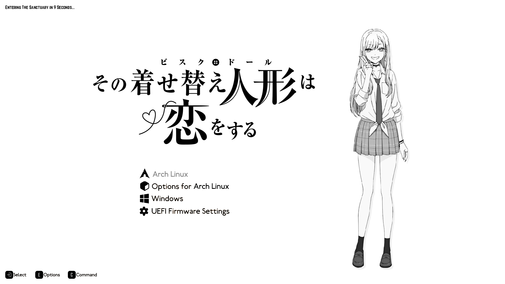

# Marin Themed Grub Menu

##### Modified version of [LoboGrubTheme by rats-scamper](https://github.com/rats-scamper/LoboGrubTheme)



A clean, monochromatic GRUB theme inspired by **Marin Kitagawa** from *Sono Bisque Doll wa Koi wo Suru*.

> **Disclaimer**
> All anime/manga artwork used in this GRUB theme belongs to their respective copyright owners.
> This is a **non-commercial fan project** intended **for personal use only** and is not affiliated with any official license holders.
> If you are a copyright holder and would like the artwork removed, please contact me.

---

## Installation

```bash
git clone https://github.com/yorunohikari/MangaMarin && cd MangaMarin && ./install.sh
```
>  If install.sh is not executable, run: chmod +x install.sh
---

### Manual installation
1. Clone this repo:
```bash
$ git clone --depth=1 https://github.com/yorunohikari/MangaMarin.git
$ cd MangaMarin
```
2. Copy ```marin/``` into ```/boot/grub/themes/```:
```bash
$ sudo cp -rf marin /boot/grub/themes/
```
3. In ```/etc/default/grub```, uncomment the line that says "GRUB_THEME" and add the path to ```theme.txt```:
```bash
$ sudoedit /etc/default/grub

# It should look like this:
GRUB_THEME="/boot/grub/themes/marin/theme.txt"
```
4. Set ```GRUB_GFXMODE=``` to the correct resolution:
```bash
GRUB_GFXMODE=1920x1080
```
5. Optionally, make Grub remember the last option selected by modifying ```GRUB_DEFAULT=``` and ```GRUB_SAVEDEFAULT=```:
```bash
GRUB_DEFAULT=saved
GRUB_SAVEDEFAULT=true # Make sure to uncomment this one.
```

---

##  Patch GRUB Entries

There are a few GRUB limitations that require additional tweaks to show everything correctly in this theme.
Run the following script to apply patches automatically:

```bash
./patch_entries.sh
```

### Manual Patching

If you prefer to do it yourself, follow the manual patching guide in the original theme’s wiki:

[https://github.com/uiriansan/LainGrubTheme/wiki/Patch-entries#patching-manually](https://github.com/uiriansan/LainGrubTheme/wiki/Patch-entries#patching-manually)

---

## Customizing

If you want to tweak the layout or visuals,
check the quick customization guide in the [wiki](https://github.com/uiriansan/LainGrubTheme/wiki/Customizing) (**note:** no `.fig` file is provided with this theme).

---

